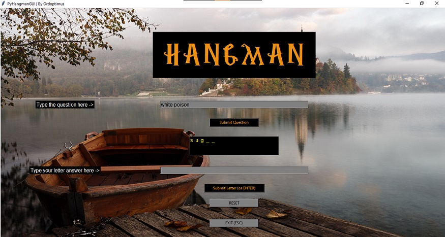
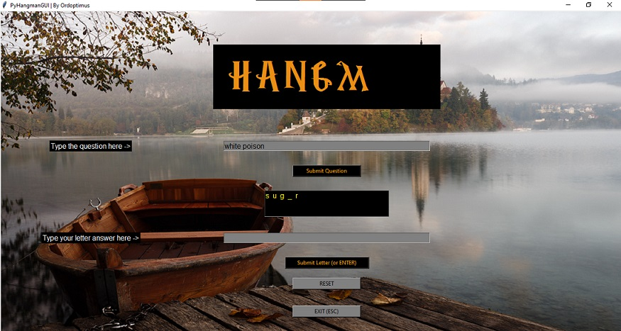

## PyHangmanGUI
A GUI-based Hangman Game in Python.

#### Features
- TKinter GUI
- Image-replacement based Hangman visualisation
- Key bindings for Submit [ENTER] and Exit [ENTER]
- Pop-up messsages for invalid inputs, repeated letters, winning, and losing
- Cursor style changes on text field hovering
- Background-image based window size (replace image to fit your display resolution)
- Dictionary with question-answer pairs in code (will later be shifted to a JSON)
___

#### Preview
  

___
Backgroung image by [Artem Sapegin](https://unsplash.com/@sapegin) on Unsplash.
